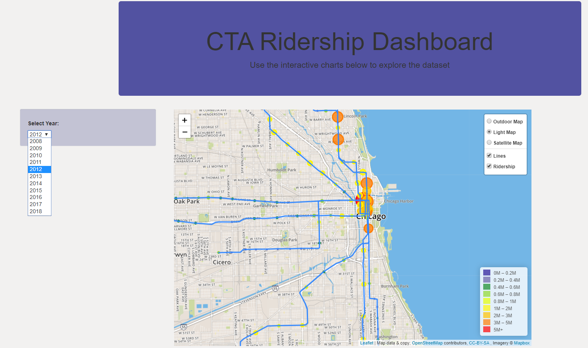
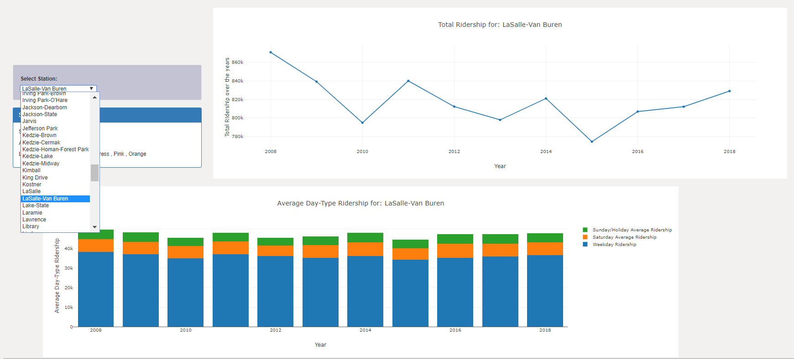

# Project Details:

## CTA Rideship Trend Dashboard over last 10 Years.

Team Members: 
1. Amy Cleveland
2. Gabriela Hernandez
3. Garima Chauhan
4. Joseph Wantroba
5. Kelly Lao

In this project we built a web dashboard which showing the ridership trend for the Chicago Transit Authority (CTA) over last years.

The data was collected from Chicago Data Portal Website.
https://data.cityofchicago.org/

The Data set-1 (https://data.cityofchicago.org/Transportation/CTA-Ridership-L-Station-Entries-Monthly-Day-Type-A/t2rn-p8d7) includes the total monthly ridership data as well as day type (weekday, saturday  weekend/ holiday) riderhip data from Year 2001 till 2018.

The Data set-2 (https://data.cityofchicago.org/Transportation/CTA-System-Information-List-of-L-Stops/8pix-ypme) includes the Station/Line information like Station Name, ADA accessibility, Line color, Location ( Latitude and Longitude) for each Station/Stop/Line.

We extracted last 10 years total ridership data from the data set-1 and merged it with the sata set-2 in order to get the information about each station.

We used SQL database in Postgres to store the data and created a flask server to load the data into Python.

We used D3, Javascript, Plotly and Leaflet to build our final charts and Map.

## The visualization dashboard include:
- Chicago map with CTA Stations and lines with Ridership information and a dropdown menu to select the year. The bubbles represent the CTA stations with bubble size and color representing the ridership data.

- A line chart showing total ridership data for last 10 years and a dropdown to select the station from. The station information includes the ADA accessibility and Line color information.

- A stacked bar graph which represent the average ridership data for different week day types.

